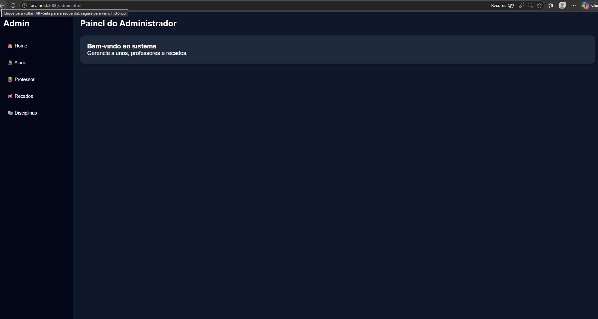
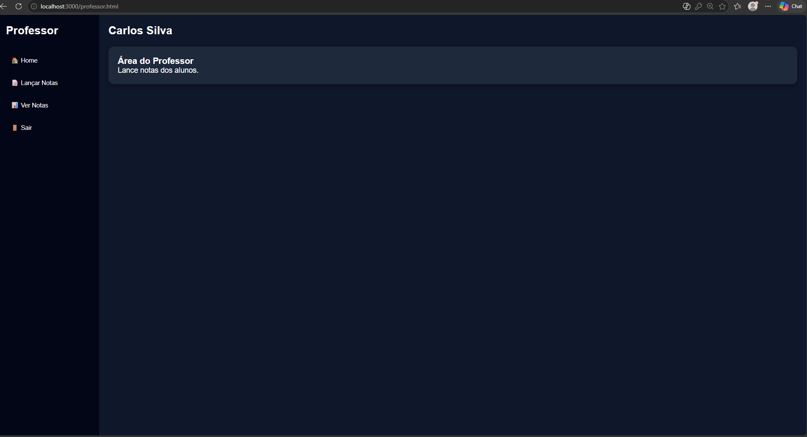
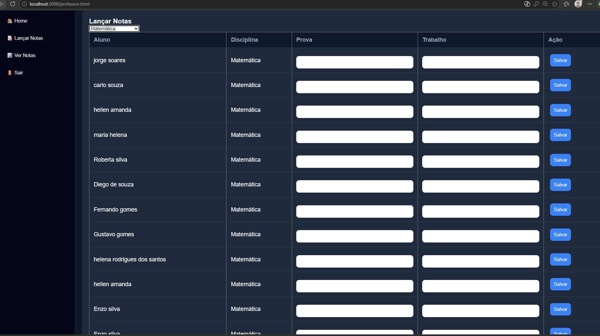
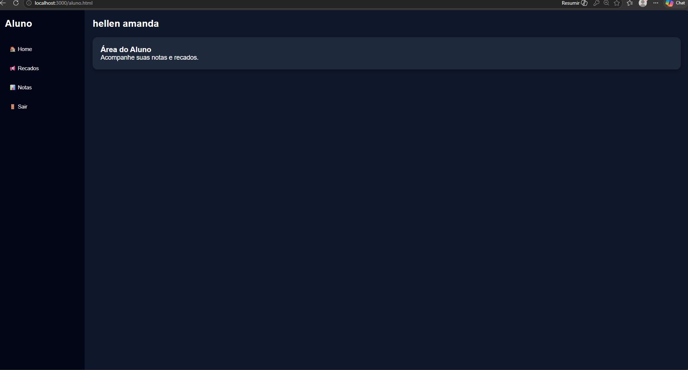

# 🎓 Sistema Escolar

Sistema escolar desenvolvido para gerenciamento de alunos, professores, matrículas e lançamento de notas.

---

# 📚 Funcionalidades

## Administrador
- Cadastro de alunos
- Cadastro de professores
- Cadastro de disciplinas
- Matrícula de alunos
- Criação de recados

## Professor
- Login autenticado
- Visualização de alunos matriculados
- Lançamento de notas
- Edição de notas
- Filtro de notas por disciplina

## Aluno
- Login do aluno
- Visualização das notas
- Visualização da média final
- Visualização de recados

---

# 🛠 Tecnologias Utilizadas

- HTML5
- CSS3
- JavaScript
- Node.js
- Express.js
- PostgreSQL
- JWT (JSON Web Token)

---

# 🔐 Autenticação

O sistema utiliza autenticação com JWT para proteger rotas privadas de professores e administradores.

---

# 🗄 Banco de Dados

O banco de dados foi modelado utilizando PostgreSQL com relacionamentos entre:

- alunos
- professores
- disciplinas
- matrículas
- notas

---

# 🚀 Como executar o projeto

## Clone o repositório

```bash
git clone URL_DO_REPOSITORIO
```

## Entre na pasta

```bash
cd nome-do-projeto
```

## Instale as dependências

```bash
npm install
```

## Configure o banco PostgreSQL

Crie o banco e configure as credenciais no arquivo:

```bash
.env
```

## Inicie o servidor

```bash
npm start
```

O sistema ficará disponível em:

```bash
http://localhost:3000
```

---

# 📸 Imagens do Sistema

## Login Administrador


## Painel do Administrador


## Login Professor


## Painel do Professor


## Lançamento de Notas


## Login Aluno


## Painel do Aluno

---

# 📖 Aprendizados

Durante o desenvolvimento deste projeto aprendi conceitos importantes como:

- CRUD completo
- Integração frontend e backend
- Autenticação JWT
- Manipulação do DOM
- Rotas protegidas
- Relacionamento entre tabelas no PostgreSQL
- Filtros dinâmicos
- Organização de código
- Consumo de API com fetch

---

# 👨‍💻 Autor

Desenvolvido por Jorge Soares.